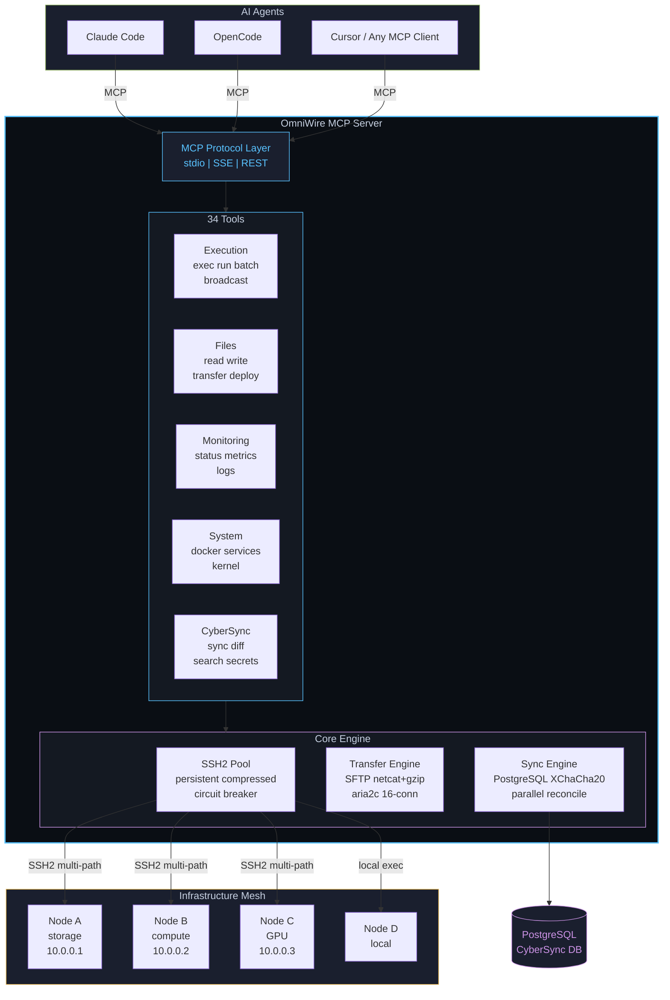

<p align="center">
  <picture>
    <source media="(prefers-color-scheme: dark)" srcset="https://capsule-render.vercel.app/api?type=waving&color=0:0A0E14,50:1A1F2E,100:59C2FF&height=200&section=header&text=OmniWire&fontSize=72&fontColor=59C2FF&animation=fadeIn&fontAlignY=35&desc=Unified%20Mesh%20Control%20Layer&descSize=18&descColor=8B949E&descAlignY=55" />
    <source media="(prefers-color-scheme: light)" srcset="https://capsule-render.vercel.app/api?type=waving&color=0:E8EAED,50:D4D8DE,100:59C2FF&height=200&section=header&text=OmniWire&fontSize=72&fontColor=0A0E14&animation=fadeIn&fontAlignY=35&desc=Unified%20Mesh%20Control%20Layer&descSize=18&descColor=586069&descAlignY=55" />
    
  </picture>
</p>

<p align="center">
  <a href="https://www.npmjs.com/package/omniwire"></a>
  
  
  
  <a href="LICENSE"></a>
</p>

<p align="center">
  <sub>One MCP server to control all your machines. Multi-path SSH2 failover, adaptive file transfers, encrypted cross-node config sync.</sub>
</p>

---

## How It Works



---

## Features at a Glance

<table>
<tr>
<td width="50%">

### Remote Execution
```
omniwire_exec       single command, any node
omniwire_run        multi-line script (compact UI)
omniwire_batch      N commands in 1 tool call
omniwire_broadcast  parallel across all nodes
```

</td>
<td width="50%">

### Adaptive File Transfer
```
 < 10 MB   SFTP         native, 80ms
 10M-1GB   netcat+gzip  compressed, 200ms
 > 1 GB    aria2c       16-parallel, max speed
```

</td>
</tr>
<tr>
<td>

### Connection Resilience
```
Connected --> Health Ping (45s)
    |              |
    |         > 5s? --> Degraded warning
    |
Failure --> Multi-path Failover
    |         WireGuard --> Tailscale --> Public IP
    |
    +--> Retry (exp. backoff)
    |         500ms -> 1s -> 2s -> ... -> 15s
    |
3 fails --> Circuit OPEN (30s)
                 --> Auto-recover
```

</td>
<td>

### CyberSync + CyberBase
```
Node A --push--> PostgreSQL (cyberbase)
    |                 |
    |            XChaCha20-Poly1305
    |            encrypted at rest
    |
    +--mirror--> Obsidian Vault
                     |
                Obsidian Sync (cloud)

6 AI tools synced automatically:
Claude  OpenCode  Codex  Gemini  ...
```

</td>
</tr>
</table>

---

## All 34 Tools

<details>
<summary><b>Execution (4 tools)</b></summary>

| Tool | Description |
|------|-------------|
| `omniwire_exec` | Run a command on any node. Supports `label` for compact display. |
| `omniwire_run` | Execute multi-line scripts via temp file. Keeps tool call UI clean. |
| `omniwire_batch` | Run N commands across nodes in a single tool call. Parallel by default. |
| `omniwire_broadcast` | Execute on all online nodes simultaneously. |

</details>

<details>
<summary><b>Monitoring (3 tools)</b></summary>

| Tool | Description |
|------|-------------|
| `omniwire_mesh_status` | Health, latency, CPU/mem/disk for all nodes |
| `omniwire_node_info` | Detailed info for a specific node |
| `omniwire_live_monitor` | Snapshot metrics: cpu, memory, disk, network |

</details>

<details>
<summary><b>Files (4 tools)</b></summary>

| Tool | Description |
|------|-------------|
| `omniwire_read_file` | Read file from any node. Supports `node:/path` format. |
| `omniwire_write_file` | Write/create file on any node |
| `omniwire_list_files` | List directory contents |
| `omniwire_find_files` | Search by glob pattern across all nodes |

</details>

<details>
<summary><b>Transfer & Deploy (2 tools)</b></summary>

| Tool | Description |
|------|-------------|
| `omniwire_transfer_file` | Copy between nodes. Auto-selects SFTP/netcat/aria2c. |
| `omniwire_deploy` | Deploy file from one node to all others in parallel |

</details>

<details>
<summary><b>System (6 tools)</b></summary>

| Tool | Description |
|------|-------------|
| `omniwire_process_list` | List/filter processes across nodes |
| `omniwire_disk_usage` | Disk usage for all nodes |
| `omniwire_tail_log` | Last N lines of a log file |
| `omniwire_install_package` | Install via apt/npm/pip |
| `omniwire_service_control` | systemd start/stop/restart/status |
| `omniwire_docker` | Run docker commands on any node |

</details>

<details>
<summary><b>Network (2 tools)</b></summary>

| Tool | Description |
|------|-------------|
| `omniwire_port_forward` | Create/list/close SSH tunnels |
| `omniwire_open_browser` | Open URL in browser on a node |

</details>

<details>
<summary><b>Advanced (4 tools)</b></summary>

| Tool | Description |
|------|-------------|
| `omniwire_kernel` | dmesg, sysctl, modprobe, lsmod, strace, perf |
| `omniwire_shell` | Persistent PTY session (preserves cwd/env) |
| `omniwire_stream` | Capture streaming output (tail -f, watch) |
| `omniwire_update` | Self-update OmniWire |

</details>

<details>
<summary><b>CyberSync (9 tools)</b></summary>

| Tool | Description |
|------|-------------|
| `cybersync_status` | Sync status, item counts, pending syncs |
| `cybersync_sync_now` | Trigger immediate reconciliation |
| `cybersync_diff` | Show local vs database differences |
| `cybersync_history` | Query sync event log |
| `cybersync_search_knowledge` | Full-text search unified knowledge base |
| `cybersync_get_memory` | Retrieve Claude memory from PostgreSQL |
| `cybersync_manifest` | Show tracked files per tool |
| `cybersync_force_push` | Force push file to all nodes |
| `omniwire_secrets` | Get/set/delete/list/sync secrets (1Password, file, env) |

</details>

---

## Quick Start

### Install

```bash
npm install -g omniwire
```

### Configure Mesh

Create `~/.omniwire/mesh.json`:

```json
{
  "nodes": [
    {
      "id": "server1",
      "host": "10.0.0.1",
      "user": "root",
      "identityFile": "id_ed25519",
      "role": "storage"
    },
    {
      "id": "server2",
      "host": "10.0.0.2",
      "user": "root",
      "identityFile": "id_ed25519",
      "role": "compute"
    }
  ]
}
```

### Add to Claude Code

```json
{
  "mcpServers": {
    "omniwire": {
      "command": "omniwire",
      "args": ["--stdio"]
    }
  }
}
```

### Interactive Mode

```bash
omniwire    # or: ow
```

---

## Performance

| Operation | Latency | Details |
|-----------|---------|---------|
| **Command exec** | `~120ms` | SSH2 + command + return |
| **Mesh status** | `~150ms` | Parallel probes, 8s cache |
| **File read (<1MB)** | `~80ms` | SFTP, binary-safe |
| **Transfer (10MB)** | `~200ms` | gzip netcat over WireGuard |
| **Config push** | `~200ms` | Parallel to all nodes + Obsidian mirror |
| **Reconcile (500 files)** | `~1.2s` | 100-file hash batches, parallel walkDir |

---

## Security

All remote execution uses `ssh2.Client.exec()`, never `child_process.exec()`. Key-based auth only, no passwords stored. Multi-path failover (WireGuard → Tailscale → Public IP) with SSH key caching. CyberBase: single PostgreSQL DB for all projects. XChaCha20-Poly1305 at-rest encryption for synced configs. 2MB output guard prevents memory exhaustion. Circuit breaker with 30s auto-recovery isolates failing nodes.

---

## Transport Modes

| Mode | Default Port | Use Case |
|------|-------------|----------|
| `--stdio` | -- | Claude Code, Cursor, MCP subprocess clients |
| `--sse-port=N` | 3200 | OpenCode, remote HTTP-based MCP clients |
| `--rest-port=N` | 3201 | Scripts, dashboards, non-MCP integrations |

```bash
omniwire --stdio                          # MCP mode
omniwire --sse-port=3200 --rest-port=3201 # HTTP mode
omniwire --stdio --no-sync               # MCP without CyberSync
```

---

## Changelog

### v2.2.1 — Security & Bug Fixes

**omniwire_exec**
- `command` is now optional when `script` is provided — previously rejected valid script-only calls
- Scripts now respect the `timeout` parameter — previously scripts could run indefinitely
- Removed unused `escaped` variable (dead code cleanup)
- Output now uses the compact `ok()` helper with label support

**omniwire_shell**
- Fixed race condition: close listener is now registered before writing commands, preventing spurious 15s timeouts on fast-completing commands

**transfer**
- Added size guard on base64 fallback — files >1MB no longer silently fail with `ARG_MAX` overflow

**REST API**
- CORS restricted from `*` to `http://localhost` — prevents cross-origin command execution from browser tabs
- Added input validation on `/api/exec` and `/api/transfer` endpoints

**Reconnect backoff**
- Fixed misleading comment: actual cap is 15s (comment previously said 30s)

---

### v2.1.0 — Multi-Path Failover & Performance

**Connectivity**
- Multi-path host resolution: WireGuard → Tailscale → Public IP per node
- Auto-reconnect tries all paths before marking node offline
- `exec()` attempts immediate reconnect on offline nodes before failing

**Performance**
- SSH key caching (no repeated disk reads)
- Compression disabled for small commands (faster round-trips)
- Reconnect backoff: 500ms start, 15s cap (was 1s/30s)
- Health ping interval: 45s (was 30s) with lighter `true` command
- Status cache: 8s TTL (was 5s)
- Circuit breaker recovery: 30s (was 60s)

**CyberSync**
- Parallel `walkDir` with 8 concurrent subdirectory scans
- Hash batch size doubled (50 → 100)
- Reconcile interval: 2min (was 5min)
- Timing in reconcile logs

**Output**
- Compact `ok()` / `fail()` helpers for cleaner Claude Code results
- `mesh_status` outputs aligned table with column headers
- `node_info` shows which host path is active (WG/Tailscale/Public)
- `exec` and `run` use `label` field as display tag

**CyberBase Integration**
- Renamed PostgreSQL database from `cybersync` to `cyberbase` (single DB for everything)
- VaultBridge: mirrors all sync items, knowledge, and memory to Obsidian-compatible markdown
- Obsidian vault at `~/Documents/BuisnessProjects/CyberBase` with Obsidian Sync for cloud backup
- Daily event logs in `vault/logs/`
- `obsidian-mcp` deployed on all mesh nodes for AI vault access

---

## Architecture

```
omniwire/
  src/
    mcp/           MCP server (34 tools, 3 transports)
    nodes/         SSH2 pool, transfer engine, PTY, tunnels
    sync/          CyberSync + CyberBase (PostgreSQL, Obsidian vault, encryption)
    protocol/      Mesh config, types, path parsing
    commands/      Interactive REPL
    ui/            Terminal formatting
```

---

## Requirements

- **Node.js** >= 20
- **SSH access** to remote nodes (key-based auth)
- **PostgreSQL** (only for CyberSync)
- **WireGuard + Tailscale** recommended (multi-path failover uses both)
- **Obsidian** (optional) for CyberBase vault browsing + Obsidian Sync cloud backup

---

<p align="center">
  <a href="LICENSE"></a>
</p>

<p align="center">
  <picture>
    <source media="(prefers-color-scheme: dark)" srcset="https://capsule-render.vercel.app/api?type=waving&color=0:0A0E14,50:1A1F2E,100:59C2FF&height=100&section=footer" />
    <source media="(prefers-color-scheme: light)" srcset="https://capsule-render.vercel.app/api?type=waving&color=0:E8EAED,50:D4D8DE,100:59C2FF&height=100&section=footer" />
    
  </picture>
</p>
