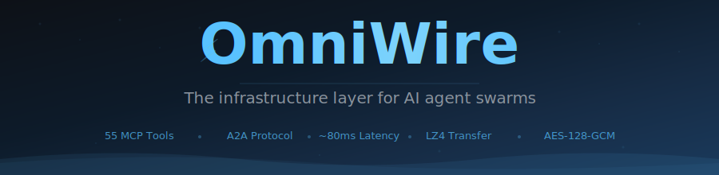
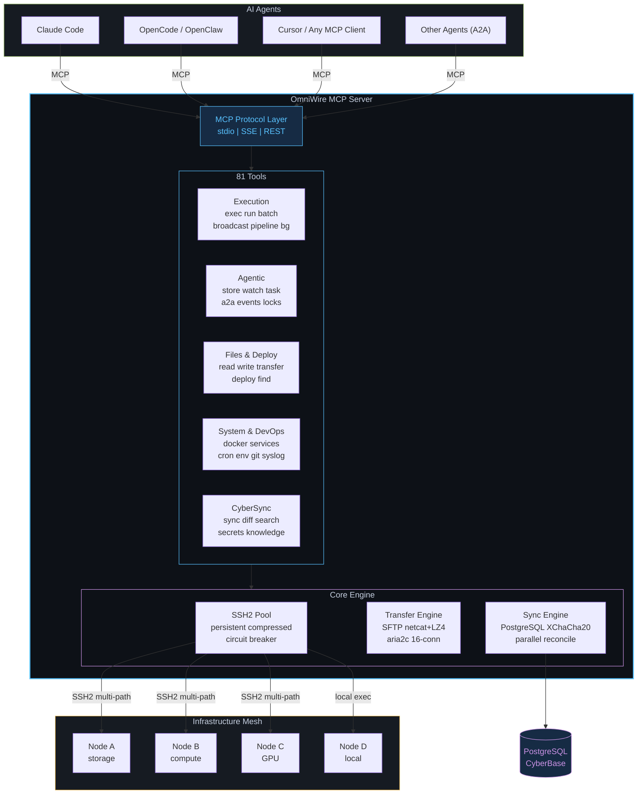

<p align="center">
  <picture>
    <source media="(prefers-color-scheme: dark)" srcset="assets/banner-dark.svg" />
    <source media="(prefers-color-scheme: light)" srcset="assets/banner-light.svg" />
    
  </picture>
</p>

<p align="center">
  <a href="https://www.npmjs.com/package/omniwire"></a>
  
  
  
  
  <a href="LICENSE"></a>
</p>

<div align="center">

**The infrastructure layer for AI agent swarms.**

81 MCP tools · A2A protocol · OmniMesh VPN · nftables firewall · CDP browser · cookie sync · CyberBase persistence

</div>

---

## Quick Start

```bash
npm install -g omniwire
```

Add to your AI agent (Claude Code, Cursor, OpenCode, etc.):

```json
{
  "mcpServers": {
    "omniwire": { "command": "omniwire", "args": ["--stdio"] }
  }
}
```

---

## Why OmniWire?

| Problem | OmniWire Solution |
|---------|-------------------|
| Managing multiple servers manually | One tool call controls any node |
| Agents can't coordinate with each other | A2A messaging, events, semaphores |
| Multi-step deploys need many round-trips | Pipelines chain steps in 1 call |
| Flaky commands break agent loops | Built-in retry + assert + watch |
| Long tasks block the agent | `background: true` on any tool |
| Results lost between tool calls | Session store with `{{key}}` interpolation |
| Different transfer methods for diff sizes | Auto-selects SFTP / netcat+LZ4 / aria2c |
| SSH connections drop | Multi-path failover + circuit breaker |

---

## Use Cases

<table>
<tr>
<td width="50%">

### DevOps & Infrastructure
```bash
# Deploy to all nodes in one call
omniwire_deploy(src="contabo:/app/v2.tar.gz", dst="/opt/app/")

# Rolling service restart
omniwire_batch([
  {node: "node1", command: "systemctl restart app"},
  {node: "node2", command: "systemctl restart app"}
], parallel=false)

# Monitor disk across fleet
omniwire_disk_usage()
```

</td>
<td width="50%">

### Security & Pentesting
```bash
# Anonymous nmap through Mullvad VPN
omniwire_exec(
  node="contabo",
  command="nmap -sV -T4 target.com",
  via_vpn="mullvad:se",
  background=true
)

# Rotate exit IP between scans
omniwire_vpn(action="rotate", node="contabo")

# Run nuclei through VPN namespace
omniwire_exec(command="nuclei -u target.com",
  via_vpn="mullvad", store_as="nuclei_results")
```

</td>
</tr>
<tr>
<td>

### Multi-Agent Coordination
```bash
# Agent A dispatches work
omniwire_task_queue(action="enqueue",
  queue="recon", task="subfinder -d target.com")

# Agent B picks it up
omniwire_task_queue(action="dequeue", queue="recon")

# Share findings on blackboard
omniwire_blackboard(action="post",
  topic="subdomains", data="api.target.com")

# A2A messaging between agents
omniwire_a2a_message(action="send",
  channel="results", message="scan complete")
```

</td>
<td>

### Background & Async Workflows
```bash
# Long build in background
omniwire_exec(
  command="docker build -t app .",
  node="contabo", background=true
)
# Returns: "BACKGROUND bg-abc123"

# Check progress
omniwire_bg(action="poll", task_id="bg-abc123")
# Returns: "RUNNING (45.2s)"

# Get result when done
omniwire_bg(action="result", task_id="bg-abc123")

# Pipeline: build → test → deploy
omniwire_pipeline(steps=[
  {node: "contabo", command: "make build"},
  {node: "contabo", command: "make test"},
  {command: "deploy.sh", store_as: "version"}
])
```

</td>
</tr>
<tr>
<td>

### File Operations
```bash
# Transfer large dataset between nodes
omniwire_transfer_file(
  src="contabo:/data/model.bin",
  dst="hostinger:/ml/model.bin"
)
# Auto-selects: aria2c (16-conn parallel)

# Sync config to all nodes
omniwire_deploy(
  src_node="contabo",
  src_path="/etc/nginx/nginx.conf",
  dst_path="/etc/nginx/nginx.conf"
)
```

</td>
<td>

### VPN & Anonymous Operations
```bash
# Full Mullvad setup for a node
omniwire_vpn(action="connect", server="se",
  node="contabo")
omniwire_vpn(action="quantum", config="on")
omniwire_vpn(action="daita", config="on")
omniwire_vpn(action="multihop", config="se:us")
omniwire_vpn(action="dns", config="adblock")
omniwire_vpn(action="killswitch", config="on")

# Verify anonymous IP
omniwire_vpn(action="ip", node="contabo")

# Node-wide VPN (mesh stays connected)
omniwire_vpn(action="full-on", server="de")
```

</td>
</tr>
</table>

---

## Architecture



---

## Key Capabilities

<table>
<tr>
<td width="50%">

### Execution
```
omniwire_exec       single command + retry + assert
omniwire_run        multi-line script (compact UI)
omniwire_batch      N commands, 1 tool call, chaining
omniwire_broadcast  parallel across all nodes
omniwire_pipeline   multi-step DAG with data flow
omniwire_bg         poll/list background tasks
```

</td>
<td width="50%">

### Multi-Agent (A2A)
```
omniwire_store        session key-value store
omniwire_a2a_message  agent-to-agent queues
omniwire_event        pub/sub event bus
omniwire_semaphore    distributed locking
omniwire_agent_task   async background dispatch
omniwire_workflow     reusable named DAGs
```

</td>
</tr>
<tr>
<td>

### Adaptive File Transfer
```
 < 10 MB   SFTP         native, 80ms
 10M-1GB   netcat+LZ4   compressed, 100ms
 > 1 GB    aria2c       16-parallel, max speed
```

</td>
<td>

### Connection Resilience
```
Connected --> Health Ping (30s, parallel)
    |
Failure --> Multi-path Failover
    |         WireGuard -> Tailscale -> Public IP
    |
    +--> Retry (300ms -> 600ms -> ... -> 10s)
    |
3 fails --> Circuit OPEN (15s) -> Auto-recover
```

</td>
</tr>
<tr>
<td>

### Background Dispatch
```
# Any tool supports background: true
exec(background=true)   -> "bg-abc123"
bg(action="poll", id=..) -> "RUNNING (3.2s)"
bg(action="result", id=..) -> full output
bg(action="list")       -> all tasks + status
```

</td>
<td>

### Agentic Chaining
```
exec(store_as="ip")       store result
exec(command="ping {{ip}}") interpolate
batch(abort_on_fail=true)   fail-fast
exec(format="json")         structured output
exec(retry=3, assert="ok")  resilient
watch(assert="ready")       poll until
```

</td>
</tr>
</table>

---

## All 81 Tools

> **Every tool** supports `background: true` — returns a task ID immediately. Poll with `omniwire_bg`.

<details>
<summary><b>Execution (6)</b></summary>

| Tool | Description |
|------|-------------|
| `omniwire_exec` | Run command on any node. `retry`, `assert`, `store_as`, `format:"json"`, `{{key}}`, `via_vpn`. |
| `omniwire_run` | Multi-line scripts via temp file. |
| `omniwire_batch` | N commands in 1 call. Chaining `{{prev}}`, `abort_on_fail`, parallel/sequential. |
| `omniwire_broadcast` | Execute on all nodes simultaneously. |
| `omniwire_pipeline` | Multi-step DAG with `{{prev}}`/`{{stepN}}` interpolation. |
| `omniwire_bg` | List/poll/retrieve background task results. |

</details>

<details>
<summary><b>Agentic / A2A (12)</b></summary>

| Tool | Description |
|------|-------------|
| `omniwire_store` | Session key-value store for cross-call chaining. |
| `omniwire_watch` | Poll until assert matches — deploys, builds, readiness. |
| `omniwire_healthcheck` | Parallel health probe all nodes (disk, mem, load, docker). |
| `omniwire_agent_task` | Background task dispatch with poll/retrieve. |
| `omniwire_a2a_message` | Agent-to-agent message queues (send/receive/peek). |
| `omniwire_semaphore` | Distributed locking — atomic acquire/release. |
| `omniwire_event` | Pub/sub events per topic. |
| `omniwire_workflow` | Reusable named workflow DAGs. |
| `omniwire_agent_registry` | Agent capability discovery + heartbeat. |
| `omniwire_blackboard` | Shared blackboard for swarm coordination. |
| `omniwire_task_queue` | Distributed priority queue — enqueue/dequeue/complete. |
| `omniwire_capability` | Query node capabilities for intelligent routing. |

</details>

<details>
<summary><b>Files & Transfer (6)</b></summary>

| Tool | Description |
|------|-------------|
| `omniwire_read_file` | Read file from any node (`node:/path`). |
| `omniwire_write_file` | Write/create file on any node. |
| `omniwire_list_files` | List directory contents. |
| `omniwire_find_files` | Glob search across nodes. |
| `omniwire_transfer_file` | Copy between nodes (auto SFTP/netcat/aria2c). |
| `omniwire_deploy` | Deploy one file to all nodes in parallel. |

</details>

<details>
<summary><b>Monitoring (3)</b></summary>

| Tool | Description |
|------|-------------|
| `omniwire_mesh_status` | Health, latency, CPU/mem/disk — all nodes. |
| `omniwire_node_info` | Detailed info for one node. |
| `omniwire_live_monitor` | Snapshot metrics: cpu, memory, disk, network. |

</details>

<details>
<summary><b>System & DevOps (12)</b></summary>

| Tool | Description |
|------|-------------|
| `omniwire_process_list` | List/filter processes across nodes. |
| `omniwire_disk_usage` | Disk usage for all nodes. |
| `omniwire_tail_log` | Last N lines of a log file. |
| `omniwire_install_package` | Install via apt/npm/pip. |
| `omniwire_service_control` | systemd start/stop/restart/status. |
| `omniwire_docker` | Docker commands on any node. |
| `omniwire_kernel` | dmesg, sysctl, modprobe, lsmod, strace, perf. |
| `omniwire_cron` | List/add/remove cron jobs. |
| `omniwire_env` | Get/set persistent environment variables. |
| `omniwire_network` | ping, traceroute, dns, ports, speed, connections. |
| `omniwire_git` | Git commands on repos on any node. |
| `omniwire_syslog` | Query journalctl with filters. |

</details>

<details>
<summary><b>Network, VPN & Security (9)</b></summary>

| Tool | Description |
|------|-------------|
| `omniwire_firewall` | nftables engine — presets, rate-limit, geo-block, port-knock, ban/unban. Mesh whitelisted. |
| `omniwire_vpn` | Mullvad/OpenVPN/WireGuard/Tailscale — multi-hop, DAITA, quantum, killswitch. Mesh-safe. |
| `omniwire_cookies` | Cookie management — JSON/Header/Netscape, browser extract, CyberBase + 1Password sync. |
| `omniwire_cdp` | Chrome DevTools Protocol — headless Chrome, screenshot, PDF, DOM, cookies. |
| `omniwire_proxy` | HTTP/SOCKS proxy management on any node. |
| `omniwire_dns` | DNS resolve, set server, flush cache, block domains. |
| `omniwire_port_forward` | SSH tunnels — create/list/close/mesh-expose. |
| `omniwire_shell` | Persistent PTY session (preserves cwd/env). |
| `omniwire_clipboard` | Shared clipboard buffer across mesh. |

</details>

<details>
<summary><b>Infrastructure (9)</b></summary>

| Tool | Description |
|------|-------------|
| `omniwire_backup` | Snapshot/restore paths. Diff, cleanup, retention. |
| `omniwire_container` | Docker lifecycle — compose, build, push, logs, prune, stats. |
| `omniwire_cert` | TLS certs — Let's Encrypt, check expiry, self-signed. |
| `omniwire_user` | User & SSH key management, sudo config. |
| `omniwire_schedule` | Distributed cron with failover. |
| `omniwire_alert` | Threshold alerting — disk/mem/load/offline + webhook notify. |
| `omniwire_log_aggregate` | Cross-node log search in parallel. |
| `omniwire_benchmark` | CPU/memory/disk/network benchmarks. |
| `omniwire_stream` | Capture streaming output (tail -f, watch). |

</details>

<details>
<summary><b>OmniMesh & Events (6)</b></summary>

| Tool | Description |
|------|-------------|
| `omniwire_omnimesh` | WireGuard mesh manager — init/up/down/add-peer/sync-peers/health/rotate-keys/topology. All OS. |
| `omniwire_mesh_expose` | Expose localhost services to mesh — discover/expose/unexpose/expose-remote. |
| `omniwire_mesh_gateway` | Auto-expose all localhost services mesh-wide. |
| `omniwire_events` | Webhook + WebSocket + SSE event bus. Publish, manage webhooks, query log. |
| `omniwire_knowledge` | CyberBase knowledge CRUD, text/semantic search, health, vacuum, bulk-set, export. |
| `omniwire_update` | Self-update from npm + GitHub. Auto-update, mesh-wide push. |

</details>

<details>
<summary><b>Agent Toolkit (7)</b></summary>

| Tool | Description |
|------|-------------|
| `omniwire_snippet` | Reusable command templates with `{{var}}` substitution. |
| `omniwire_alias` | In-session command shortcuts. |
| `omniwire_trace` | Distributed tracing — span waterfalls across nodes. |
| `omniwire_doctor` | Health diagnostics — SSH, disk, mem, docker, WireGuard, CyberBase. |
| `omniwire_metrics` | Prometheus-compatible metrics scrape/export. |
| `omniwire_audit` | Command audit log — view/search/stats. |
| `omniwire_plugin` | Plugin system — list/load from `~/.omniwire/plugins/`. |

</details>

<details>
<summary><b>CyberSync (9)</b></summary>

| Tool | Description |
|------|-------------|
| `cybersync_status` | Sync status, item counts, pending syncs. |
| `cybersync_sync_now` | Trigger immediate reconciliation. |
| `cybersync_diff` | Local vs database differences. |
| `cybersync_history` | Sync event log. |
| `cybersync_search_knowledge` | Full-text search unified knowledge base. |
| `cybersync_get_memory` | Retrieve Claude memory from PostgreSQL. |
| `cybersync_manifest` | Tracked files per tool. |
| `cybersync_force_push` | Force push file to all nodes. |
| `omniwire_secrets` | Secrets management (1Password, file, env). |

</details>

---

## Performance

| Operation | Latency | Optimization |
|-----------|---------|-------------|
| **Command exec** | **~80ms** | AES-128-GCM cipher, persistent SSH2, zero-fork `:` ping |
| **Mesh status** | **~100ms** | Parallel probes, 5s cache, single `/proc` read |
| **File read (<1MB)** | **~60ms** | SFTP-first (skips `cat` fork) |
| **Transfer (10MB)** | **~120ms** | LZ4 compression (10x faster than gzip) |
| **Transfer (1GB)** | **~8s** | aria2c 16-connection parallel |
| **Pipeline (5 steps)** | **~400ms** | `{{prev}}` interpolation, no extra tool calls |
| **Health check (all)** | **~90ms** | Parallel Promise.allSettled |
| **A2A message** | **~85ms** | File-append queue, atomic dequeue |
| **Reconnect** | **~300ms** | 300ms initial, 2s keepalive, 15s circuit breaker |

<details>
<summary><b>Optimization details</b></summary>

- **Cipher**: AES-128-GCM (AES-NI hardware accelerated)
- **Key exchange**: curve25519-sha256 (fastest modern KEX)
- **Keepalive**: 2s interval, 2 retries = 4s dead detection
- **Port finder**: `shuf` (pure bash) replaces `python3 -c socket` (-30ms)
- **Compression**: LZ4-1 for transfers (10x faster than gzip)
- **Buffer**: Array push + join (O(n) vs O(n^2) string concat)
- **Status**: Single `/proc` read replaces multiple piped commands
- **Health ping**: `:` builtin (no hash lookup, no fork)
- **Reads**: SFTP tried first, `cat` fallback only on failure
- **Circuit breaker**: 15s recovery, 10s reconnect cap

</details>

---

## Security

- All remote execution via `ssh2.Client.exec()` -- never `child_process.exec()`
- Key-based auth only, no passwords stored, SSH key caching
- Multi-path failover: WireGuard -> Tailscale -> Public IP
- XChaCha20-Poly1305 at-rest encryption for synced configs
- 2MB output guard prevents memory exhaustion
- 4KB auto-truncation prevents context window bloat
- Circuit breaker isolates failing nodes
- CORS restricted to localhost on REST API

---

## Transport Modes

| Mode | Port | Use Case |
|------|------|----------|
| `--stdio` | -- | Claude Code, Cursor, MCP subprocess |
| `--sse-port=N` | 3200 | OpenCode, remote HTTP MCP clients |
| `--rest-port=N` | 3201 | Scripts, dashboards, non-MCP |

```bash
omniwire --stdio                          # MCP mode (default)
omniwire --sse-port=3200 --rest-port=3201 # HTTP mode
omniwire --stdio --no-sync               # MCP without CyberSync
omniwire    # or: ow                      # Interactive REPL
```

---

## Configure Mesh

Create `~/.omniwire/mesh.json`:

```json
{
  "nodes": [
    { "id": "server1", "host": "10.0.0.1", "user": "root", "identityFile": "id_ed25519", "role": "storage" },
    { "id": "server2", "host": "10.0.0.2", "user": "root", "identityFile": "id_ed25519", "role": "compute" }
  ]
}
```

---

## Changelog

<details>
<summary><b>v3.0.0 -- 81 Tools, CyberBase Persistence, Full Platform</b></summary>

**19 new tools**: proxy, dns, backup, container, cert, user, schedule, alert, log_aggregate, benchmark, snippet, alias, trace, doctor, metrics, audit, plugin, cookies, cdp.

**CyberBase auto-persistence**: Store, audit, blackboard, cookies all sync to PostgreSQL. pgvector semantic search. 5s statement_timeout on all DB calls.

**Architecture**: Priority command queues, smart output truncation, predictive node selection, latency history, connection pool stats.

**Security**: Command denylist (blocks rm -rf /, fork bombs, disk wipes). Audit log with CyberBase persistence.

**A2A**: Typed message schemas (JSON validation), dead letter queue for failed tasks, pub/sub event filters.

**DX**: GitHub Actions CI, bash/zsh/fish shell completions, --json flag, cookie sync to 1Password.

</details>

<details>
<summary><b>v2.7.0 -- Firewall Engine</b></summary>

**`omniwire_firewall`**: nftables-based firewall engine with 17 actions. Presets (server, paranoid, minimal, pentest), rate-limiting, geo-blocking by country, port-knocking sequences, IP ban/unban, whitelist/blacklist, rule management, audit log, save/restore.

**Zero mesh impact**: wg0, wg1, tailscale0, and all mesh CIDRs (10.10.0.0/24, 10.20.0.0/24, 100.64.0.0/10) are always whitelisted before any hardening rules. nftables runs in kernel space — zero latency overhead.

</details>

<details>
<summary><b>v2.6.0 -- VPN Integration, Mesh-Safe Anonymous Scanning</b></summary>

**`omniwire_vpn`** tool: Mullvad, OpenVPN, WireGuard, Tailscale. Split-tunnel (per-command) + full-node modes. Mesh connectivity (wg0, wg1, Tailscale) always preserved via route exclusions and network namespace isolation.

**`via_vpn` on exec**: Route any command through VPN using Linux network namespaces. Only the command's traffic goes through VPN — SSH/WireGuard mesh stays on real interface.

**Modes**: `connect` (split-tunnel), `full-on` (node-wide with mesh exclusions), `rotate` (new exit IP), `status`, `list`, `ip`.

</details>

<details>
<summary><b>v2.5.1 -- Universal Background Dispatch</b></summary>

**`background: true`** auto-injected into all 81 tools via server-level wrapper. Returns task ID, poll with `omniwire_bg`. New `omniwire_bg` tool for list/poll/result.

</details>

<details>
<summary><b>v2.5.0 -- Performance Overhaul, A2A Protocol Expansion</b></summary>

**Performance**: AES-128-GCM cipher, curve25519-sha256 KEX, 2s keepalive, LZ4 transfers (10x faster), `shuf` port finder (-30ms), SFTP-first reads, array buffer concat, `/proc` single-read status, `:` builtin health ping, 300ms reconnect start, 15s circuit breaker.

**4 new A2A tools** (49 -> 53): agent_registry (capability discovery), blackboard (swarm collaboration), task_queue (distributed work), capability (node routing).

</details>

<details>
<summary><b>v2.4.0 -- Agentic Loop, A2A, Multi-Agent Orchestration</b></summary>

9 new agentic tools (40 -> 49): store, pipeline, watch, healthcheck, agent_task, a2a_message, semaphore, event, workflow. Agentic upgrades: `format:"json"`, `retry`, `assert`, `store_as`, `{{key}}` interpolation.

</details>

<details>
<summary><b>v2.3.0 -- Compact Output, Speed, New Tools</b></summary>

Output overhaul (auto-truncation, smart time, tabular multi-node). 6 new DevOps tools (cron, env, network, clipboard, git, syslog).

</details>

<details>
<summary><b>v2.2.1 -- v2.1.0</b></summary>

Security fixes, multi-path SSH failover, CyberBase integration, VaultBridge Obsidian mirror.

</details>

---

```
omniwire/
  src/
    mcp/           MCP server (81 tools, 3 transports)
    nodes/         SSH2 pool, transfer engine, PTY, tunnels
    sync/          CyberSync + CyberBase (PostgreSQL, Obsidian, encryption)
    protocol/      Mesh config, types, path parsing
    commands/      Interactive REPL
    ui/            Terminal formatting
```

**Requirements:** Node.js >= 20 &bull; SSH key access to nodes &bull; PostgreSQL (CyberSync only) &bull; WireGuard recommended

---

## Changelog

| Version | Date | Changes |
|---------|------|---------|
| **v3.1.4** | 2026-03-29 | Auto-sync CyberBase writes to Obsidian vault + Canvas mindmap, collision-avoidance grid placement, `sync-obsidian` / `sync-canvas` actions in knowledge tool |
| **v3.1.3** | 2026-03-29 | OmniMesh WireGuard mesh manager, event bus (Webhook/WS/SSE), knowledge tool (12 actions), auto-update system, CDP rewrite (persistent Docker container, 18 actions), mesh expose/gateway, CyberBase circuit breaker + SQL hardening |
| **v3.1.2** | 2026-03-28 | Collapsible tool sections in README, npm README sync |
| **v3.1.1** | 2026-03-28 | Bug fixes, improved error handling in CDP tool |
| **v3.1.0** | 2026-03-27 | OmniMesh VPN, 81 MCP tools, A2A protocol, event system, background dispatch |
| **v3.0.0** | 2026-03-25 | Major rewrite: CyberSync, pipeline DAGs, blackboard, task queues, LZ4 transfers, AES-128-GCM encryption |
| **v2.6.1** | 2026-03-20 | VPN routing (Mullvad/OpenVPN/WG/Tailscale), multi-hop, DAITA, quantum tunnels |
| **v2.5.0** | 2026-03-15 | Firewall management (nftables), cert management, deploy tool |
| **v2.0.0** | 2026-03-10 | CDP browser automation, cookie sync, 1Password integration |
| **v1.0.0** | 2026-03-01 | Initial release — SSH exec, file transfer, node management |

---

<br/>

<p align="center">
  <a href="https://www.npmjs.com/package/omniwire"></a>
  <a href="https://github.com/VoidChecksum/omniwire/stargazers"></a>
  <a href="https://github.com/VoidChecksum/omniwire/issues"></a>
</p>

<p align="center">
  <picture>
    <source media="(prefers-color-scheme: dark)" srcset="assets/footer-dark.svg" />
    <source media="(prefers-color-scheme: light)" srcset="assets/footer-light.svg" />
    
  </picture>
</p>
