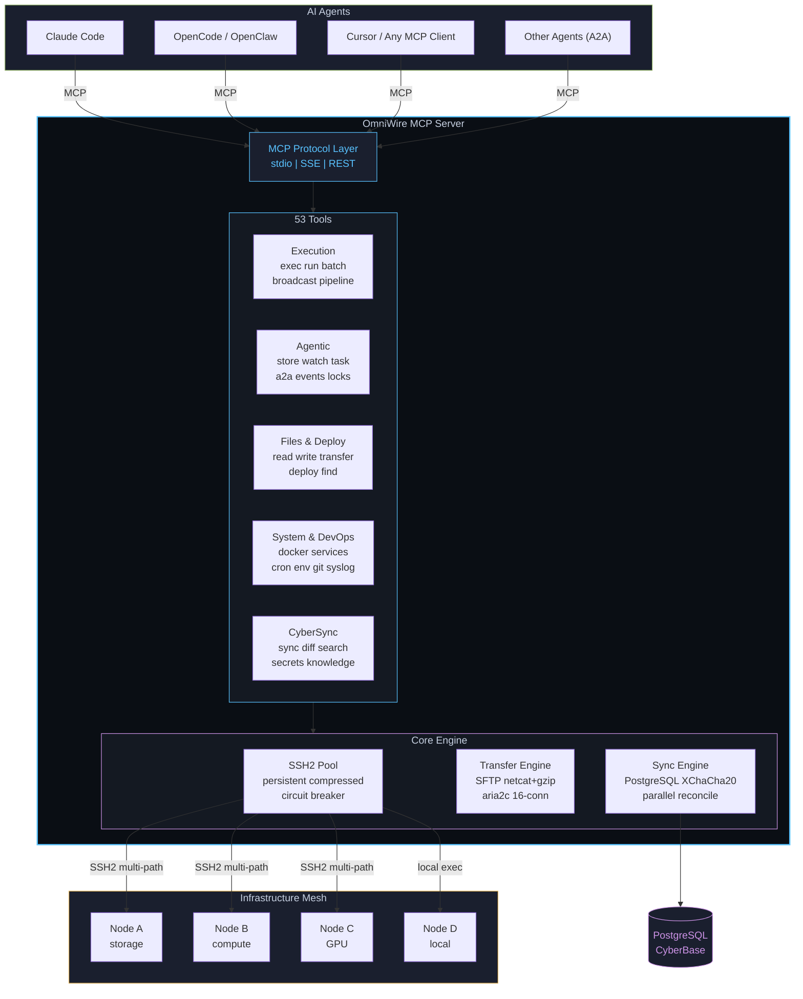

<p align="center">
  <picture>
    <source media="(prefers-color-scheme: dark)" srcset="https://capsule-render.vercel.app/api?type=venom&color=0:0A0E14,50:0D1B2A,100:1B2838&height=220&section=header&text=OmniWire&fontSize=80&fontColor=59C2FF&animation=fadeIn&fontAlignY=32&desc=Multi-Agent%20Mesh%20Control%20%E2%80%94%2053%20MCP%20Tools%20%C2%B7%20A2A%20Protocol%20%C2%B7%20~80ms%20Latency&descSize=16&descColor=8B949E&descAlignY=58" />
    <source media="(prefers-color-scheme: light)" srcset="https://capsule-render.vercel.app/api?type=venom&color=0:E8EAED,50:D4D8DE,100:59C2FF&height=220&section=header&text=OmniWire&fontSize=80&fontColor=0A0E14&animation=fadeIn&fontAlignY=32&desc=Multi-Agent%20Mesh%20Control%20%E2%80%94%2053%20MCP%20Tools%20%C2%B7%20A2A%20Protocol%20%C2%B7%20~80ms%20Latency&descSize=16&descColor=586069&descAlignY=58" />
    
  </picture>
</p>

<p align="center">
  <a href="https://www.npmjs.com/package/omniwire"></a>
  
  
  
  
  <a href="LICENSE"></a>
</p>

<br/>

<p align="center">
  <b>The infrastructure layer for AI agent swarms.</b>
</p>

<p align="center">
53 MCP tools &bull; Agent-to-Agent messaging &bull; Distributed task queues &bull; Capability routing<br/>
AES-128-GCM SSH2 &bull; LZ4 transfers &bull; Circuit breakers &bull; Multi-path failover<br/>
Session chaining &bull; Pipeline DAGs &bull; Blackboard architecture &bull; Event pub/sub
</p>

<br/>

> **v2.5** &mdash; AES-128-GCM cipher preference, 2s keepalive, LZ4 compression, `shuf` port finder, SFTP-first reads, agent registry, blackboard, task queues, capability routing. See [changelog](#changelog).

<br/>

---

## Quick Start

```bash
npm install -g omniwire
```

Add to your AI agent (Claude Code, Cursor, OpenCode, etc.):

```json
{
  "mcpServers": {
    "omniwire": { "command": "omniwire", "args": ["--stdio"] }
  }
}
```

---

## Why OmniWire?

| Problem | OmniWire Solution |
|---------|-------------------|
| Managing multiple servers manually | One tool call controls any node |
| Agents can't coordinate with each other | A2A messaging, events, semaphores |
| Multi-step deploys need many round-trips | Pipelines chain steps in 1 call |
| Flaky commands break agent loops | Built-in retry + assert + watch |
| Long tasks block the agent | Background dispatch with task IDs |
| Results lost between tool calls | Session store with `{{key}}` interpolation |
| Different transfer methods for diff sizes | Auto-selects SFTP / netcat / aria2c |
| SSH connections drop | Multi-path failover + circuit breaker |

---

## Architecture



---

## Key Capabilities

<table>
<tr>
<td width="50%">

### Execution
```
omniwire_exec       single command + retry + assert
omniwire_run        multi-line script (compact UI)
omniwire_batch      N commands, 1 tool call, chaining
omniwire_broadcast  parallel across all nodes
omniwire_pipeline   multi-step DAG with data flow
```

</td>
<td width="50%">

### Multi-Agent (A2A)
```
omniwire_store        session key-value store
omniwire_a2a_message  agent-to-agent queues
omniwire_event        pub/sub event bus
omniwire_semaphore    distributed locking
omniwire_agent_task   async background dispatch
omniwire_workflow     reusable named DAGs
```

</td>
</tr>
<tr>
<td>

### Adaptive File Transfer
```
 < 10 MB   SFTP         native, 80ms
 10M-1GB   netcat+gzip  compressed, 100ms
 > 1 GB    aria2c       16-parallel, max speed
```

</td>
<td>

### Connection Resilience
```
Connected --> Health Ping (30s, parallel)
    |
Failure --> Multi-path Failover
    |         WireGuard -> Tailscale -> Public IP
    |
    +--> Retry (500ms -> 1s -> ... -> 15s)
    |
3 fails --> Circuit OPEN (20s) -> Auto-recover
```

</td>
</tr>
<tr>
<td>

### Agentic Chaining
```
exec(store_as="ip")       store result
exec(command="ping {{ip}}") interpolate
batch(abort_on_fail=true)   fail-fast
exec(format="json")         structured output
exec(retry=3, assert="ok")  resilient
watch(assert="ready")       poll until
```

</td>
<td>

### CyberSync + CyberBase
```
Nodes --push--> PostgreSQL (cyberbase)
  |                  |
  |             XChaCha20-Poly1305
  |             encrypted at rest
  |
  +--mirror--> Obsidian Vault
                    |
               Obsidian Sync (cloud)
```

</td>
</tr>
</table>

---

## All 53 Tools

### Execution (5)

| Tool | Description |
|------|-------------|
| `omniwire_exec` | Run command on any node. `retry`, `assert`, `store_as`, `format:"json"`, `{{key}}` interpolation. |
| `omniwire_run` | Execute multi-line scripts via temp file. Keeps tool call UI clean. |
| `omniwire_batch` | N commands in 1 call. Chaining with `{{prev}}`, `abort_on_fail`, parallel or sequential. |
| `omniwire_broadcast` | Execute on all nodes simultaneously. JSON format support. |
| `omniwire_pipeline` | Multi-step DAG. `{{prev}}`/`{{stepN}}` interpolation, per-step error handling, cross-node. |

### Agentic / A2A (13)

| Tool | Description |
|------|-------------|
| `omniwire_store` | Session key-value store. Persist results across tool calls for chaining. |
| `omniwire_watch` | Poll command until assert pattern matches. For deploys, builds, service readiness. |
| `omniwire_healthcheck` | Parallel health probe across all nodes (connectivity, disk, mem, load, docker). Single call. |
| `omniwire_agent_task` | Dispatch background tasks. Get task IDs, poll status, retrieve results. A2A async. |
| `omniwire_a2a_message` | Agent-to-agent message queues. Send/receive/peek on named channels. |
| `omniwire_semaphore` | Distributed locking. Atomic acquire/release to prevent race conditions. |
| `omniwire_event` | Pub/sub events. Emit/poll timestamped events per topic. ACP/A2A/ACPX compatible. |
| `omniwire_workflow` | Define and run reusable named workflows (DAGs). Stored on disk, triggered by any agent. |
| `omniwire_agent_registry` | Register/discover agents by capabilities. Dynamic A2A routing. Heartbeat. |
| `omniwire_blackboard` | Shared blackboard for agent swarms. Post findings, read, search across topics. |
| `omniwire_task_queue` | Distributed task queue. Enqueue/dequeue with priorities. Complete/fail reporting. |
| `omniwire_capability` | Query node capabilities (tools, runtimes, GPU). Intelligent task routing. |

### Files & Transfer (6)

| Tool | Description |
|------|-------------|
| `omniwire_read_file` | Read file from any node. `node:/path` format. |
| `omniwire_write_file` | Write/create file on any node. |
| `omniwire_list_files` | List directory contents. |
| `omniwire_find_files` | Glob search across all nodes. |
| `omniwire_transfer_file` | Copy between nodes. Auto-selects SFTP/netcat/aria2c. |
| `omniwire_deploy` | Deploy file from one node to all others in parallel. |

### Monitoring (3)

| Tool | Description |
|------|-------------|
| `omniwire_mesh_status` | Health, latency, CPU/mem/disk for all nodes. Tabular output. |
| `omniwire_node_info` | Detailed info for a specific node. |
| `omniwire_live_monitor` | Snapshot metrics: cpu, memory, disk, network. |

### System & DevOps (12)

| Tool | Description |
|------|-------------|
| `omniwire_process_list` | List/filter processes across nodes |
| `omniwire_disk_usage` | Disk usage for all nodes |
| `omniwire_tail_log` | Last N lines of a log file |
| `omniwire_install_package` | Install via apt/npm/pip |
| `omniwire_service_control` | systemd start/stop/restart/status |
| `omniwire_docker` | Docker commands on any node |
| `omniwire_kernel` | dmesg, sysctl, modprobe, lsmod, strace, perf |
| `omniwire_cron` | List/add/remove cron jobs |
| `omniwire_env` | Get/set persistent environment variables |
| `omniwire_network` | ping, traceroute, dns, ports, speed, connections |
| `omniwire_git` | Git commands on repos on any node |
| `omniwire_syslog` | Query journalctl with filters |

### Network & Misc (5)

| Tool | Description |
|------|-------------|
| `omniwire_port_forward` | Create/list/close SSH tunnels |
| `omniwire_open_browser` | Open URL in browser on a node |
| `omniwire_shell` | Persistent PTY session (preserves cwd/env) |
| `omniwire_stream` | Capture streaming output (tail -f, watch) |
| `omniwire_clipboard` | Shared clipboard buffer across mesh |

### CyberSync (9)

| Tool | Description |
|------|-------------|
| `cybersync_status` | Sync status, item counts, pending syncs |
| `cybersync_sync_now` | Trigger immediate reconciliation |
| `cybersync_diff` | Show local vs database differences |
| `cybersync_history` | Query sync event log |
| `cybersync_search_knowledge` | Full-text search unified knowledge base |
| `cybersync_get_memory` | Retrieve Claude memory from PostgreSQL |
| `cybersync_manifest` | Show tracked files per tool |
| `cybersync_force_push` | Force push file to all nodes |
| `omniwire_secrets` | Get/set/delete/list/sync secrets (1Password, file, env) |
| `omniwire_update` | Self-update OmniWire |

---

## Performance

| Operation | Latency | v2.5 Optimization |
|-----------|---------|-------------------|
| **Command exec** | **~80ms** | AES-128-GCM cipher, persistent SSH2 channel, zero-fork `:` ping |
| **Mesh status** | **~100ms** | Parallel probes, 5s cache, single `/proc` read (no pipes) |
| **File read (<1MB)** | **~60ms** | SFTP-first path (skips `cat` shell fork) |
| **Transfer (10MB)** | **~120ms** | LZ4 compression (10x faster than gzip), 50ms bind delay |
| **Transfer (1GB)** | **~8s** | aria2c 16-connection parallel, 150ms server startup |
| **Pipeline (5 steps)** | **~400ms** | `{{prev}}` interpolation, no extra tool calls |
| **Health check (all)** | **~90ms** | Parallel Promise.allSettled, structured JSON |
| **A2A message** | **~85ms** | File-append queue, atomic dequeue |
| **Config push** | **~150ms** | Parallel deploy + Obsidian mirror |
| **Reconnect** | **~300ms** | 300ms initial delay (was 500ms), 2s keepalive detection |

**Optimizations in v2.5:**
- **Cipher**: AES-128-GCM (AES-NI accelerated) preferred over default negotiation
- **Key exchange**: curve25519-sha256 preferred (fastest modern KEX)
- **Keepalive**: 2s interval, 2 retries = 4s dead detection (was 6s)
- **Port finder**: `shuf` (pure bash) replaces `python3 -c socket` (saves ~30ms per transfer)
- **Compression**: LZ4-1 for transfers (10x faster than gzip, ~same ratio for mixed data)
- **Buffer**: Array push + join replaces string concatenation (O(n) vs O(n^2) for large outputs)
- **Status**: Single `/proc` read replaces multiple piped commands
- **Health ping**: `:` builtin replaces `true` (no hash lookup, no fork)
- **Reads**: SFTP subsystem tried first, falls back to `cat` only on failure
- **Circuit breaker**: 15s recovery (was 20s), 10s reconnect cap (was 15s)

---

## Security

- All remote execution via `ssh2.Client.exec()` -- never `child_process.exec()`
- Key-based auth only, no passwords stored, SSH key caching
- Multi-path failover: WireGuard -> Tailscale -> Public IP
- XChaCha20-Poly1305 at-rest encryption for synced configs
- 2MB output guard prevents memory exhaustion
- 4KB auto-truncation prevents context window bloat
- Circuit breaker with 20s auto-recovery isolates failing nodes
- CORS restricted to localhost on REST API

---

## Transport Modes

| Mode | Port | Use Case |
|------|------|----------|
| `--stdio` | -- | Claude Code, Cursor, MCP subprocess |
| `--sse-port=N` | 3200 | OpenCode, remote HTTP MCP clients |
| `--rest-port=N` | 3201 | Scripts, dashboards, non-MCP |

```bash
omniwire --stdio                          # MCP mode (default)
omniwire --sse-port=3200 --rest-port=3201 # HTTP mode
omniwire --stdio --no-sync               # MCP without CyberSync
omniwire    # or: ow                      # Interactive REPL
```

---

## Configure Mesh

Create `~/.omniwire/mesh.json`:

```json
{
  "nodes": [
    { "id": "server1", "host": "10.0.0.1", "user": "root", "identityFile": "id_ed25519", "role": "storage" },
    { "id": "server2", "host": "10.0.0.2", "user": "root", "identityFile": "id_ed25519", "role": "compute" }
  ]
}
```

---

## Changelog

<details>
<summary><b>v2.5.0 -- Performance Overhaul, A2A Protocol Expansion</b></summary>

**Performance**: AES-128-GCM cipher, curve25519-sha256 KEX, 2s keepalive, LZ4 transfers (10x faster), `shuf` port finder (-30ms), SFTP-first reads, array buffer concat, `/proc` single-read status, `:` builtin health ping, 300ms reconnect start, 15s circuit breaker.

**4 new A2A tools** (49 -> 53): agent_registry (capability discovery), blackboard (swarm collaboration), task_queue (distributed work), capability (node routing).

**Connectivity**: Always-on 2s keepalive with 4s dead detection. 5s connect timeout. 10s reconnect cap. 15s circuit recovery.

</details>

<details>
<summary><b>v2.4.0 -- Agentic Loop, A2A, Multi-Agent Orchestration</b></summary>

**9 new agentic tools** (40 -> 49): store, pipeline, watch, healthcheck, agent_task, a2a_message, semaphore, event, workflow

**Agentic upgrades to existing tools**: `format:"json"`, `retry`, `assert`, `store_as`, `{{key}}` interpolation on exec/broadcast/batch

**Dynamic response processing**: Structured JSON output, step-to-step data flow, session result store, abort-on-fail chains

</details>

<details>
<summary><b>v2.3.0 -- Compact Output, Speed, New Tools</b></summary>

Output overhaul (auto-truncation, smart time, tabular multi-node). Performance (parallel health pings, 3s keepalive, 20s circuit breaker, 6s connect timeout). 6 new DevOps tools (cron, env, network, clipboard, git, syslog).

</details>

<details>
<summary><b>v2.2.1 -- Security & Bug Fixes</b></summary>

Fixed script-only exec, shell race condition, transfer size guard, CORS restriction, input validation.

</details>

<details>
<summary><b>v2.1.0 -- Multi-Path Failover & Performance</b></summary>

Multi-path SSH (WireGuard/Tailscale/Public), SSH key caching, CyberBase integration, VaultBridge Obsidian mirror.

</details>

---

## Architecture

```
omniwire/
  src/
    mcp/           MCP server (53 tools, 3 transports)
    nodes/         SSH2 pool, transfer engine, PTY, tunnels
    sync/          CyberSync + CyberBase (PostgreSQL, Obsidian, encryption)
    protocol/      Mesh config, types, path parsing
    commands/      Interactive REPL
    ui/            Terminal formatting
```

## Requirements

- **Node.js** >= 20
- **SSH access** to remote nodes (key-based auth)
- **PostgreSQL** (only for CyberSync)
- **WireGuard + Tailscale** recommended (multi-path failover)

---

<p align="center">
  <a href="LICENSE"></a>
</p>

<p align="center">
  <picture>
    <source media="(prefers-color-scheme: dark)" srcset="https://capsule-render.vercel.app/api?type=waving&color=0:0A0E14,50:1A1F2E,100:59C2FF&height=100&section=footer" />
    <source media="(prefers-color-scheme: light)" srcset="https://capsule-render.vercel.app/api?type=waving&color=0:E8EAED,50:D4D8DE,100:59C2FF&height=100&section=footer" />
    
  </picture>
</p>
