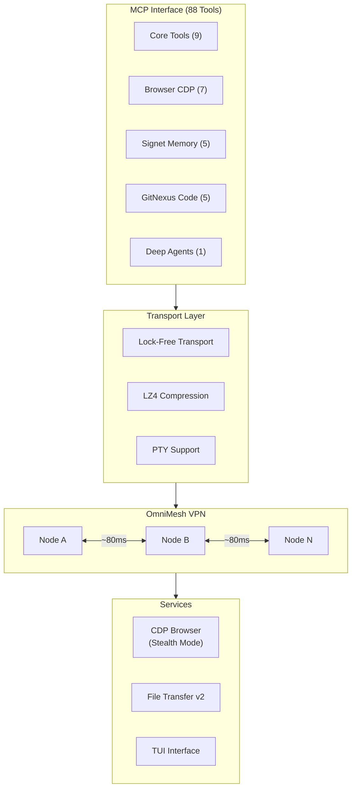

<div align="center">

```
 ██████╗ ███╗   ███╗███╗   ██╗██╗██╗    ██╗██╗██████╗ ███████╗
██╔═══██╗████╗ ████║████╗  ██║██║██║    ██║██║██╔══██╗██╔════╝
██║   ██║██╔████╔██║██╔██╗ ██║██║██║ █╗ ██║██║██████╔╝█████╗
██║   ██║██║╚██╔╝██║██║╚██╗██║██║██║███╗██║██║██╔══██╗██╔══╝
╚██████╔╝██║ ╚═╝ ██║██║ ╚████║██║╚███╔███╔╝██║██║  ██║███████╗
 ╚═════╝ ╚═╝     ╚═╝╚═╝  ╚═══╝╚═╝ ╚══╝╚══╝ ╚═╝╚═╝  ╚═╝╚══════╝
```

**High-performance mesh networking infrastructure for AI agent swarms**

[](https://www.rust-lang.org/)
[](https://modelcontextprotocol.io)
[](LICENSE)
[](Cargo.toml)
[](Cargo.toml)

</div>

---

## Overview

OmniWire is a high-performance mesh networking layer designed to connect and coordinate AI agent swarms. It provides a unified infrastructure for agent-to-agent (A2A) communication, distributed memory, code intelligence, and remote node control — all accessible via the Model Context Protocol (MCP).

---

## Architecture



---

## Features

- **88 MCP Tools** — Full Model Context Protocol implementation covering core ops, browser automation, memory, code intelligence, and agent delegation
- **OmniMesh VPN** — Encrypted peer-to-peer mesh with ~80ms latency between nodes
- **Lock-Free Transport** — High-throughput message passing with zero-contention data paths
- **LZ4 Compression** — Transparent payload compression for bandwidth-sensitive agent workloads
- **CDP Browser** — Chromium DevTools Protocol integration with stealth mode for headless automation
- **PTY Support** — Full pseudo-terminal support for remote shell execution
- **Signet Memory** — Distributed key-value memory layer for persistent agent state (5 MCP tools)
- **GitNexus Code** — Code intelligence: context, queries, impact analysis, cypher, change tracking (5 MCP tools)
- **Deep Agents** — Single unified agent delegation tool bridging all sub-agents
- **File Transfer v2** — Chunked, resumable file transfer across mesh nodes
- **TUI Interface** — Terminal UI for real-time mesh monitoring and control

---

## Crate Structure

```
omniwire/
├── omniwire-core/          # Core mesh protocol and routing
├── omniwire-transport/     # Lock-free transport + LZ4 compression
├── omniwire-mcp/           # MCP server (88 tools)
├── omniwire-browser/       # CDP stealth browser automation
├── omniwire-memory/        # Signet distributed memory
├── omniwire-code/          # GitNexus code intelligence
├── omniwire-pty/           # PTY session management
└── omniwire-tui/           # Terminal UI
```

---

## MCP Tools Reference

| Category | Count | Tools |
|----------|-------|-------|
| Core | 9 | `mesh_status`, `node_run`, `node_file_read`, `node_file_write`, `node_file_transfer`, `node_proc_list`, `node_proc_kill`, `node_sysctl`, `node_telemetry` |
| Browser | 7 | `node_browser_launch`, `node_browser_navigate`, `node_browser_click`, `node_browser_screenshot`, `node_browser_eval_js`, `node_browser_close`, `node_clipboard_read` |
| Memory | 5 | `memory_store`, `memory_recall`, `memory_forget`, `memory_inject`, `memory_graph` |
| Code | 5 | `code_context`, `code_query`, `code_impact`, `code_cypher`, `code_changes` |
| Agents | 1 | `agent_delegate` |

---

## Installation

```bash
# Clone the repository
git clone https://github.com/VoidChecksum/omniwire
cd omniwire

# Build all crates (Rust 2024 edition required)
cargo build --release --workspace

# Run the daemon
./target/release/omniwired --config omniwire.toml

# CLI
./target/release/omniwire status
./target/release/omniwire mesh list
```

---

## Requirements

- Rust 1.80+ (edition 2024)
- Linux (nftables for mesh firewall rules)
- Chromium/Chrome (for browser tools)
- Node.js 20+ (for MCP server runtime)

---

## License

MIT — see [LICENSE](LICENSE)
